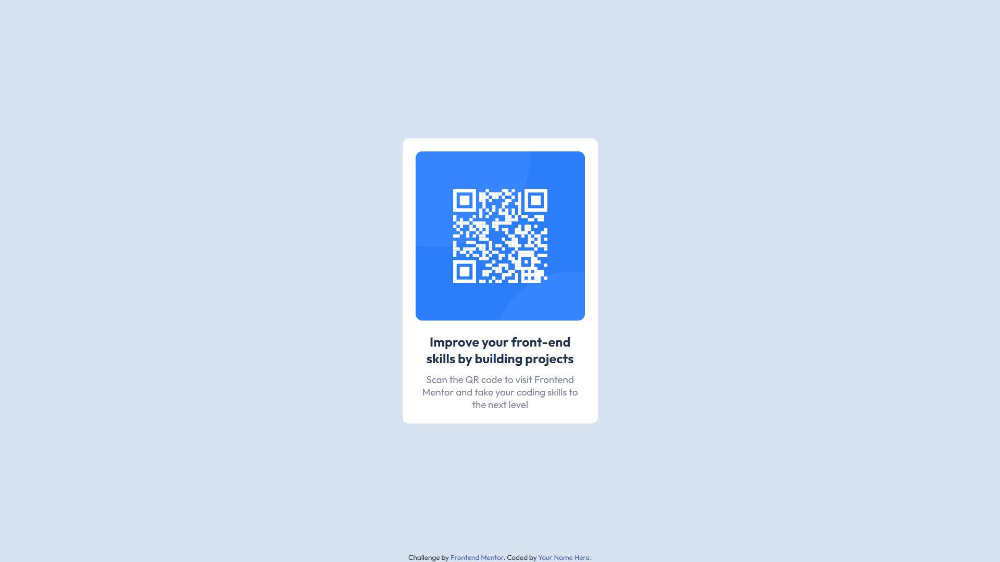

# Frontend Mentor - QR code component solution
This is a solution to the  QR code component challenge on Frontend Mentor (https://www.frontendmentor.io/challenges/qr-code-component-iux_sIO_H). 

### Screenshot

### Links

- Solution URL: (https://www.frontendmentor.io/solutions/qr-code-component-solution-using-flexbox-Hp2yUqohNt)
- Live Site URL: (https://raphaelsiqueiira.github.io/QR-code-component/)

### Built with

- Semantic HTML5 markup
- CSS custom properties
- Flexbox

## Author

- Frontend Mentor - [@raphaelsiqueiira](https://www.frontendmentor.io/profile/raphaelsiqueiira)
